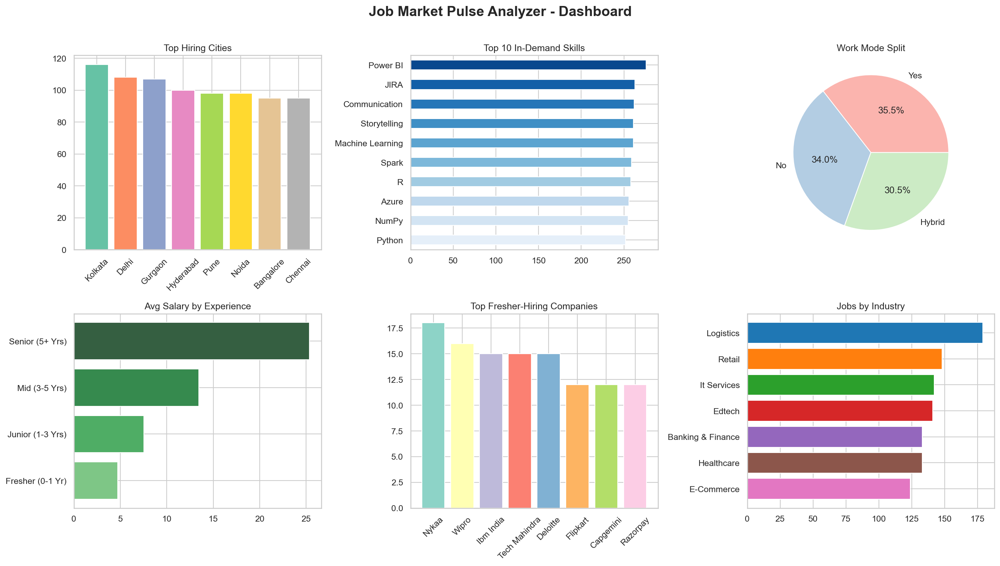

# 📊 Job Market Pulse Analyzer

> A data analytics project that analyzes the Indian job market for Data Analyst roles — uncovering top hiring cities, in-demand skills, salary trends, and fresher opportunities.

---

## 🎯 Project Objective

Most job seekers apply blindly. This project answers:
- **Which cities** have the most Data Analyst jobs?
- **Which skills** are employers demanding the most?
- **How much salary** can you expect at each experience level?
- **Which companies** are best for freshers?
- **Remote vs On-site** — what's the current trend?

---

## 🛠️ Tech Stack

| Tool | Purpose |
|------|---------|
| Python | Core programming |
| Pandas | Data cleaning & analysis |
| Matplotlib | Charts & visualizations |
| Seaborn | Advanced visualizations |
| OpenPyXL | Excel report generation |

---

## 📁 Project Structure

```
JobMarketAnalyzer/
│
├── data/
│   ├── job_market_data.csv        # Raw dataset (1000 job records)
│   └── cleaned_job_data.csv       # Cleaned dataset
│
├── outputs/
│   ├── 1_top_cities.png
│   ├── 2_top_skills.png
│   ├── 3_salary_by_experience.png
│   ├── 4_salary_by_city.png
│   ├── 5_remote_split.png
│   ├── 6_fresher_companies.png
│   ├── 7_industry_distribution.png
│   ├── 8_salary_distribution.png
│   ├── 9_salary_heatmap.png
│   ├── 10_dashboard.png           # Full summary dashboard
│   └── analysis_summary.xlsx      # Excel report with all insights
│
├── generate_dataset.py            # Creates realistic job market dataset
├── data_cleaning.py               # Cleans and preprocesses data
├── analysis.py                    # Extracts key insights
├── visualizations.py              # Generates all 10 charts
├── main.py                        # Run entire project in one command
├── requirements.txt               # Python dependencies
└── README.md
```

---

## 🚀 How to Run

```bash
# Clone the repo
git clone https://github.com/YOUR_USERNAME/JobMarketAnalyzer.git
cd JobMarketAnalyzer

# Run the full project
python main.py
```

That's it! All charts and the Excel report will be generated automatically.

---

## 📊 Key Insights Found

- **Bangalore, Mumbai & Hyderabad** are the top 3 hiring cities
- **SQL, Python & Excel** are the top 3 most demanded skills
- **Freshers** can expect **3–6.5 LPA** on average
- **Senior analysts (5+ yrs)** earn up to **35 LPA**
- **~33% jobs** offer Remote or Hybrid work options
- **IT Services & E-Commerce** industries hire the most analysts

---

## 📈 Sample Dashboard



---

## 👤 Author

**Krish**
- BSc IT | CGPA: 8.90
- Data Analytics & Data Science Certified
- [LinkedIn](https://linkedin.com/in/YOUR_PROFILE) | [GitHub](https://github.com/YOUR_USERNAME)

---

## ⭐ If you found this useful, give it a star!
